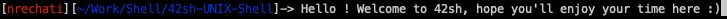

# UNIX Project : 42sh, a UNIX Shell based on POSIX standards

This project is my **Final Project** at **42** for the **UNIX System** specialization. Me and my team worked on this projet for 5 months toward the validation of our first specialization : *UNIX System in C*

## Disclaimer

Sources and Build found on this git is a copy of files we turned in for the project validation. I did it so it can be easily clone, make and run regardeless of access to external library and sources. The Codebase was also cleaned for the validation. The downside of this is it doesn't show the original git history. If you are interessted in it, you can check the original project [here](https://github.com/Nrechati/42sh)

> **Note :** The project on the original won't compile because you won't have access to our LibC implementation submodule. Moreover, a lot of last optimization and codebase fix where done on the repository given to us for the project validation. Thus for anything beside looking at git history, this repository is more reliable than the original.

## Credits

This project was done as a team effort with :
- [Frederic 'ffoissey' Foissey](https://github.com/ffoissey)
- [Cedrid 'cempassi' M'Passi](https://github.com/cempassi)
- [Sébastien 'skuppers' Küppers](https://github.com/skuppers)

Links to their GitHub page included.

## Abstract

The goal of this project was to implement a rather complete **UNIX Shell** regarding **POSIX Standards**. During our UNIX System specialization at 42 we had to first get to work with UNIX File system, Shellscript, Signals, Syscall, Shell environnement, Binaries and Built-ins along with a lot of C design patterns. This project was the perfect use case to bring it all together to implement our **own shell using C with no external library or functions, from scratch**.

Besides all project requirements we had to implement few library to build our architecture.
- **Hash table** library. Find more [here](https://github.com/Nrechati/HashMap)
- Our own implementation of **`printf`** as standard one is forbidden by the project. Find more on the `libft` directory of this project.
- A **State Machine** library for Lexing, Parsing and Execution. Find more on the `libft` directory of this project.
- A **Vector** library to handle line editing and general string manipulation, as standard one is forbidden by the project. Find more on the `libft` directory of this project.
- Using our **LibC** implementation , as standard one is forbidden by the project. Find more on the `libft` directory of this project.

> **Note** : For a full understanding of this project, see `Subject_42sh.en.pdf` on this repository

## How to Run

To run this program :

- Clone this repository `git clone https://github.com/Nrechati/42sh-UNIX-Shell.git`
- Just `make`
- `./42sh` to run

>Note : Program was built on MacOS Mojave and I know there is some workaround to do to compile on Linux as well (mostly for syscalls)

## Ressources

As the project stipulate that the shell has to be based on a **Official POSIX Shell**, we chose **bash --posix** for our own. The project also says that this reference is a starting point and that some features or behaviors can differs from it as long as it is an implementation or architectural choice and not just for convevience.

For **POSIX standards**, we mostly relied on :
- [Unix.com](https://www.unix.com/)
- [GNU.org](https://www.gnu.org/)
- [The Open Group](https://publications.opengroup.org/)
- [The Manual of Termcaps](https://www.gnu.org/software/termutils/manual/termcap-1.3/html_mono/termcap.html), for line editing in the shell

Alongside with a lot of other documentations like [GCC](https://gcc.gnu.org/onlinedocs/) one for Lexer/Paser or [American Fuzzy Loop](http://lcamtuf.coredump.cx/afl/) fuzzer for testing.

## Features

### Basic Features

- Prompt
- Command execution with arguments
- $PATH managment
- Homemade error handling (no errno), and process/shell return values
- Tab and Space in prompt managment

### Separators and Redirections

- Redirections and fd aggregation : `>` , `>>` , `<`, `<<`, `>&`, `<&`
- Pipes : `|`
- Commands separator : `;`
- Logical operator `&&` and `||`

### Internal variables

- Shell internal variables handling
- Variable assignation `name=value`
- Variable export to environement via `export` built-in
- Local variable assignation, `ls PWD=~/`
- Special parameters managment : `$?`, `$$`, `$!`, `$-`, `$0`

### Line Editing

- Complete line editing managment *(Multiple lines, Copy, Paste, home, end, arrows, etc ...)*
- Sub-prompt managment

### Job Control

- Job control managment
- `jobs`, `fg`, `bg`, `&` operand, built-in to interact with jobs

### Signals

- Signal managment
- Correct return value managment upon singals

### Inhibitors

- `"` double quotes, `'` simple quotes and `\` backslash inhibitors managment

### Expansion

- Simple expansion with `${}` and `$`
- Tilde expansion
- `${parameter:-word}`
- `${parameter:=word}`
- `${parameter:?word}`
- `${parameter:+word}`
- `${#parameter}`
- `${parameter%}`
- `${parameter%%}`
- `${parameter#}`
- `${parameter##}`

### Arithmetic expansion `$((...))`

- Post and Pre Increment and Decrement with `++` and `--`
- Addition and Substraction `+` and `-`
- Multiplication, Division, Modulo with `*`, `/`, `%`
- Comparison `<=`, `>=`, `<`, `>`
- Equality or not `==` and `!=`
- Logical AND & OR with `&&` , `||`
- Brackets and parantheses `{}`, `[]`, `()`

### History Managment

- Full history managment
- Expansion `!!`
- Expansion `!word`
- Expansion `!number`
- Expansion `!-number`
- Incremental research with `Ctrl + R`
- Up and down arrow research in history
- History file save
- `fc` Built-in

### Contextual auto-completion

- Command and Built-in completion
- File completion
- Internal variables completion

### Hash table

- Hash table for binaries and built-ins
- Use of [HashMap lib](https://github.com/Nrechati/HashMap)
- `hash` built-in according to POSIX standards

### Batch mode

- Command execution with `-c` in batch mode
- Piped command execution in batch mode

### Built-in according to POSIX Standards (except for set and unset)

- **cd**
- **echo**
- **exit**
- **type**
- **set**
- **unset**
- **export**
- **jobs**
- **fg**
- **bg**
- **fc**
- **hash**
- **pwd**
- **test**
